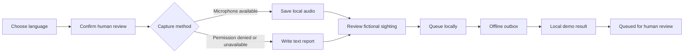
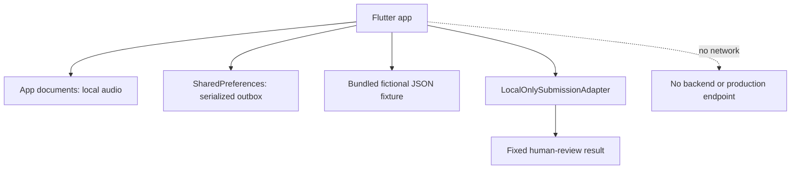

# RAVENCRY Voice Relay

> **Offline voice-sighting intake for human review.**
>
> A Flutter companion for preparing a fictional missing-person sighting report
> when connectivity is weak or unavailable. Runs on **Android** and **iOS**.

**RAVENCRY Voice Relay is not an emergency dispatch service.** If someone is
in immediate danger, call **112**. The app never claims a report was delivered,
an alert was issued, or emergency services were contacted.

---

## Why it exists

Voice Relay provides a low-bandwidth path from a local sighting report to a
human-review queue. It uses a dark, high-contrast interface, large controls,
five Nigerian language choices, and a text-only fallback when a microphone is
not available.



## Experience at a glance

| Capability | What the app does | What it never does |
| --- | --- | --- |
| **Language + consent** | Supports English, Hausa, Yoruba, Igbo, and Pidgin; requires human-review acknowledgement. | Lets a user continue without consent. |
| **Voice capture** | Requests microphone permission and saves audio locally as `.m4a`. | Uploads audio or performs cloud transcription. |
| **Text fallback** | Keeps the report flow usable if recording is denied or unavailable. | Leaves the user at a dead end. |
| **Fixture review** | Shows the supplied fictional Hausa transcript, English gloss, time, location, and language. | Uses real case data or claims a sighting is verified. |
| **Offline outbox** | Persists queued reports on-device across restarts. | Sends, broadcasts, or delivers a report. |
| **Demo submission** | Returns the deterministic local result `DEMO-VOICE-001`. | Contacts a server or emergency service. |

## Quick start

### Prerequisites

- Flutter `3.41.6` and Dart `3.11.4`, or a compatible newer toolchain.
- Android SDK plus an emulator/device for Android.
- Xcode plus an iOS Simulator/device for iOS.
- JDK **17–21** for Android builds. JDK 25 is not compatible with this
  project's Gradle setup.

### Install and run

```bash
flutter pub get
flutter devices
flutter run -d <device-id>
```

### Build

```bash
# Android
flutter build apk --debug

# iOS: use Xcode signing before physical-device deployment
flutter build ios --debug --no-codesign
```

## Demo walkthrough

1. Select **Hausa** and acknowledge that a human reviews reports.
2. Start and stop a local recording, or select **Use text instead**.
3. Enter text when using the fallback, then select **Prepare text response**.
4. Select **Review report** to view the fictional sighting fixture.
5. Select **Queue for human review** to store the report locally.
6. Open the **Outbox** to confirm it remains queued after reopening the app.
7. Select **Try sending (local demo)** to show the safe, deterministic result:

```json
{
  "status": "queued_for_human_review",
  "case_reference": "DEMO-VOICE-001",
  "message": "Saved for human review. This demo has not contacted emergency services."
}
```

## Local-only design



| Area | Implementation |
| --- | --- |
| Local recording | `record` writes `.m4a` files inside the app documents directory. |
| Text-only path | Native Flutter `TextField`; used when recording is unavailable or declined. |
| Report persistence | `shared_preferences` stores serialized `VoiceRelayReport` items locally. |
| Demo fixture | Bundled application asset; no database, API key, or remote content is required. |
| Submission boundary | Replaceable `VoiceRelaySubmissionAdapter`; only `LocalOnlySubmissionAdapter` is implemented. |

## Privacy, safety, and permissions

| Platform | Permission / storage | Behaviour |
| --- | --- | --- |
| Android | `RECORD_AUDIO` | Requested only when local voice capture begins. |
| iOS | `NSMicrophoneUsageDescription` | Explains that audio is saved locally on the device. |
| Both | App-local audio and preferences | No network request, authentication, map, push notification, or background sync. |

The bundled report is fictional demonstration data. Do not add real case data,
production URLs, secrets, API keys, credentials, or real contact numbers.

## Data contract

The JSON Schema is available at
[`docs/voice-relay-contract.schema.json`](docs/voice-relay-contract.schema.json).
It defines the serialized report fields and the local demo-result contract.

```text
VoiceRelayReport
├── client_submission_id
├── known_case_id (optional)
├── kind: sighting
├── language: en | ha | yo | ig | pcm
├── transcript
├── location_label
├── captured_at (ISO 8601)
├── audio_local_path (optional)
├── status: queued | sent_stub | failed
└── consent_confirmed
```

## Verify the app

```bash
flutter analyze
flutter test
```

The widget test covers the entire demo story: consent gating, the text fallback,
fixture review, local queueing, simulated restart persistence, and the local
submission stub.

## Project map

```text
lib/main.dart                             Screens, local capture, outbox, and submission stub
assets/fixtures/voice-relay-sighting.json Fictional sighting used by every demo state
docs/voice-relay-contract.schema.json     Report and submission-result JSON Schema
test/widget_test.dart                     End-to-end widget test
android/                                  Android runner and microphone declaration
ios/                                      iOS runner and microphone usage description
```

## Git hygiene

The repository ignores build output, Dart/Pub caches, Android and iOS generated
dependencies, IDE files, service configuration, local signing material, and
environment files. Commit the source, fixture, schema, `pubspec.yaml`, and
`pubspec.lock`; never commit `build/`, `.dart_tool/`, `ios/Pods/`, signing keys,
credentials, or `.env` files.

## Current scope

Implemented: **VR-00 through VR-05** — scaffold, safety shell, language and
consent, local capture and fallback, fixture review, persistent outbox, and the
local-only submission stub.

Remaining delivery work: manual device QA, proof screenshots/demo clip, and
handoff documentation.
